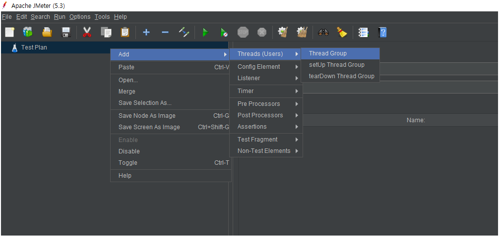
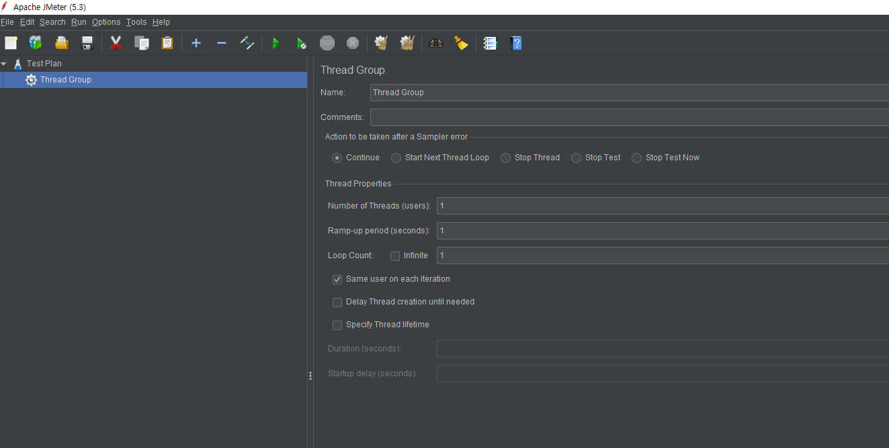
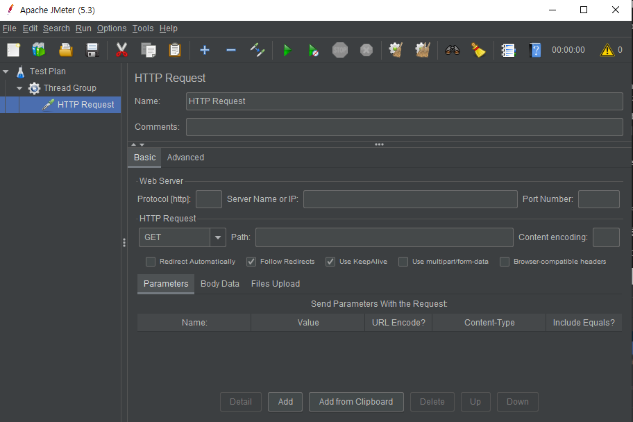

# jmeter 사용법

## 1. 설치 환경
window10 x64

## 2. jmeter 다운로드
https://jmeter.apache.org/download_jmeter.cgi 이동

Binaries 섹션에서 apache-jmeter-5.3.zip( 현재 작성일 기준 버전) 다운로드

  

## 3. java 설치
Apache JMeter 5.3일 경우 java8+ 설치

  

## 4. jmeter 설치 
다운로드 받은 apache-jmeter-5.3.zip 압축해제

apache-jmeter-5.3\apache-jmeter-5.3\bin 이동

jmeter.bat 또는 ApacheJMeter 실행

## 5. 테스트 플랜 작성
jemeter는 쓰레드를 이용하여 테스트를 실행한다. 

jmeter 화면에서 왼쪽 패널의 Test Plan에서
마우스 오른쪽 버튼을 클릭하여 나오는 Context menu에서 
`add > Threads(Users) > Thread Group` 선택하여 Thread Group을 생성한다. 

`Test Plan > Thread Group`이 생성되면 
Thread Group 선택하여 환경 설정을 해주는데 
주요 환경설정은 그림과 같다.

1. __Name__ : thread group 이름 
   
2. __Comments__ : thread group 설명
   
3. __Action to be taken after a Sampler error__  
    Sampler 즉 테스트 수행시 에러가 발생할 경우 취할 행동
    - __continue__ : 에러가 발생해도 테스트를 수행한다.
    - __Start Next Thread Loop__ : 에러가 발생시 쓰레드의 다음 반복을 시작한다. 
    - __Stop Thread__ : 에러가 발생한 thread를 멈춘다. 
    - __Stop Test__ : 테스트를 멈춘다. 
    - __Stop Test Now__ : 테스트를 당장 멈춘다.
  
4. __Thread Properties__ : 쓰레드 설정
   - __Number of Threads (users)__ : 몇 개의 쓰레드를 생성할지 설정.
   - __Ramp-up period (seconds)__ : 쓰레드를 깨우고 시작하는 시간이다. 
  
      만약 쓰레드가 10개, Ramp-up period를  1로 설정하면 이전 쓰레드가 시작된 후 (1/10)초 단위로 쓰레드를 깨우고 실행한다.
   - __Loop Count__ : 실행 횟수
     - __Same user on each iteration__ : 반복을 수행했을 때 동일한 사용자(세션 아이디) 또는 다른 사용자(세션 아이디)로 수행할 것인지를 설정. 
     - __Delay Thread creation until needed__ : 활성화 되어 있으면 Ramp-up period 옵션에 지정한 시간에 Thread를 생성한다. 비활성화 되어 있으면 미리 쓰레드를 생성한 후 정지 상태로 만든 후 Ramp-up period 옵션에 지정한 시간에 쓰레드를 깨운다.
     - __Specify Thread lifetime__ :

## 6. Sampler 생성
thread를 설정했다면 thread를 이용하여 수행할 Sampler를 작성해야한다. 

생성된 thread group에 오른쪽 마우스 클릭을 하여 contextmenu를 활성하고 
`Add > Sampler` 로 이동한다. 

Sampler에는 여러 종류가 있는데 그 중에서 HTTP Request 선택한다. 

HTTP Request의 옵션은 다음과 같다. 

1. __Name__
2. __Comments__
3. __Basic__ : 기본 설정
   * __Web Server__ : 요청을 보낼 웹서버 정보 
     - __protocol [http]__ : http, https, ftp 등 통신 방식을 지정한다.
     - __Server Name or IP__ : 아이피 또는 도메인 이름. 
     - __Port Number__ : 서비스 포트 번호
  
   * __HTTP Request__ : get, post, put 등의 HTTP 요청 방식
     - __content encoding__ : 인코디 방식 (euc-kr, utf-8, ...)
4. Advanced : 추가 설정 

  

## 7. 동적인 값을 이용한 테스트
먼저 동적으로 만들 텍스트 파일을 생성한다. 

각각의 인자값은 comma(,)로 구분하고 각 쓰레드당 할당될 인자값 그룹은 CRLF 로 구분한다. 

동적 파라미터를 담은 텍스트 파일을 만든 후 

Test Plan의 context menu 에서 ADD > Config Element > CSV Data Set Config 선택한다. 

환경설정 옵션은 다음과 같다. 
1. __Name__
2. __Comments__
3. __Configure the CSV Data Source__
   * __filename__ : 인자 값이 있는 텍스트 파일 경로
   * __file encoding__ : 
   * __Variable Names(comma-delimited)__ : 인자값과 매칭한 변수 이름. 변수 이름은 콤마로 나열 하며 변수를 통해서 동적으로 인자값이 할당된다.
   * __Ignore first line (only used if Variable Names is not empty)__ : 첫 번째 라인을 무시한다. 첫번째 라인에 필드명을 지정했을 경우 사용하면된다. 
   * __Delimiter(use "\t" for tab)__ : 각 인자값을 구분하는 구분자 
   * __Allow quoted data__ : 인자값이 쌍 따옴표(")로 감싸져 있을 경우 true로 설정한다. 데이터에 개행 문자 또는 특수 문자가 포함될 경우 쌍 따옴표(") 감싸고 이 옵션을 활성화한다.
   * __Recycle on EOF__ : 인자값 할당이 끝났을 때 다시 처음부터 인자값 할당을 반복할지 여부
   * __Stop thread on EOF__ : 인자값 할당이 끝났을 때 thread 멈출지 여부 
   * __Sharing mode__ : 인자값 공유 설정
     - __All threads__ : 모든 쓰레드 공유
     - __Current thread group__ : 현재 쓰레드 그룹 공유
     - __Current thread__ : 현재 쓰레드만 공유
  

## 8. jmeter 구조와 범위 
JMeter는 구조에 따라 적용 범위가 달라진다. 

만약 두 개의 request가 있을 경우 각각의 request 밑에 csv 설정 파일이 있고 csv 파일의 변수 명이 같다고 하더라도 csv의 변수 범위는 상위 계층인 Request에 한정되기 때문에 겹치지 않는다. 

~~~cmd
test plan

  - thread group
  
      - request1
         - csv file1
         
      - request2
        - csv file2
~~~

상위 계층의 csv 파일에 변수 명과 하위 계층의 csv파일의 변수 명이 겹칠 경우 

마지막 하위 계층의 변수 값을 적용한다.

~~~cmd
test plan
  - csv file0
  - thread group
  
      - request1
         - csv file1
         
      - request2
        - csv file2
~~~

