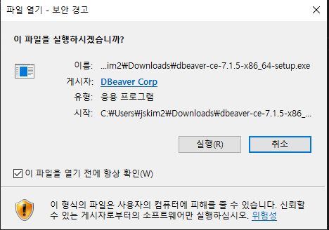
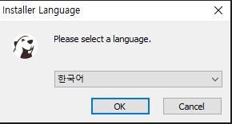

# DBeaver
DBeaver는 무료로 제공되는 데이터베이스 관리 툴이며 다양한 플랫폼을 지원한다. 

JDBC 드라이버를 지원하는 데이터베이스를 지원합니다. 

서로 다른 데이터베이스를 관리하는 툴을 지원합니다.

## 1. 설치 
아래 경로에서 운영체제에 맞는 install 파일을 다운로드 합니다.

https://dbeaver.io/download/ 

다운받은 후 실행합니다.

언어는 한글을 선택합니다. 

## csv로 데이터 DATE 형식 
csv로 date를 가져올 때는 yyyy-mm-dd HH:mm:ss 형식으로 가져와야 한다.